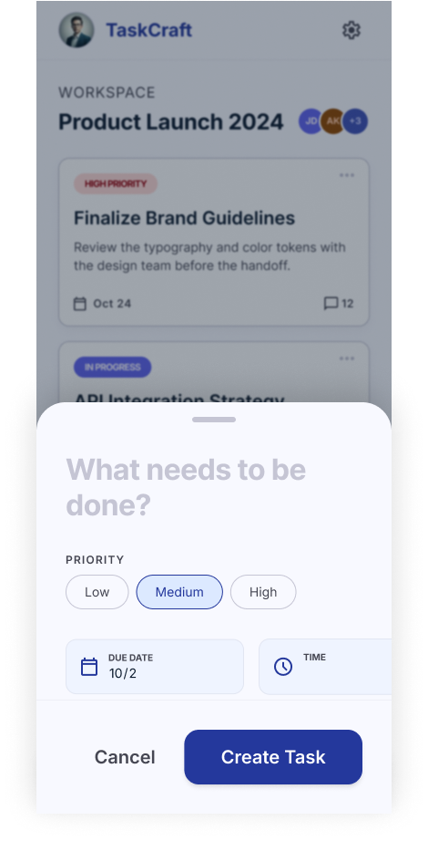
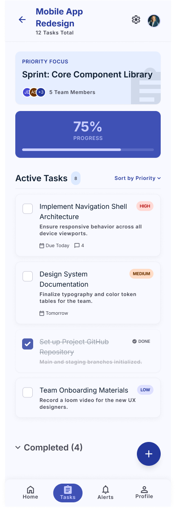

#  Task Craft — Production-Ready Task Engine

A high-performance, enterprise-grade task management application built with **Flutter** and **Dart**. This repository serves as an architectural blueprint shifting away from basic, fragmented state tracking into a strict, **Single Source of Truth (SSOT)** data pipeline optimized for sub-millisecond fluid UI adaptations and flawless rendering stability.

---

##  Architecture Philosophy & System Overview

Task Craft strictly implements **Clean Architecture** decoupled into isolated layers (**Domain, Data, and Presentation**), driving robust modularity and seamless unit testing. 

State mutations are completely governed by the **BLoC (Business Logic Component)** pattern, ensuring strict unidirectional data flows. By utilizing a highly semantic, type-safe state union mechanism powered by **Freezed**, the application enforces predictable user interfaces while maintaining optimal performance profiles.

---

##  Advanced Core Features & Engineering Breakthroughs

Here is an explicit technical breakdown of the architectural overhauls and strategic implementations engineered within this codebase:

### 1. Unified, Enum-Driven Dynamic UI Pipeline
- **The Problem:** Traditional codebases scatter multiple `state.maybeWhen` or `state.maybeMap` structural blocks across a view layout, forcing separate UI widgets to continuously query states independently, leading to uncoordinated rendering boundaries and rigid layout schemas.
- **The Solution:** We collapsed these fractured UI boundaries into a highly declarative, singular **`state.when` layout engine** inside `TasksViewContent`. The layout dynamically maps over the system **`TaskStatus` Enum** values (`pending`, `inProgress`, `done`). 
- **The Benefit:** It automatically spawns dedicated headers (`BuildTasksListHeaderSection`) and isolated lists (`BuildTaskList`) per status. If a new business rule adds a status (e.g., `inReview`), the UI scales automatically with **zero lines of code altered** in the view layer.

### 2. Layout-Preserving, Geometry-Matched Shimmer Engines
- **The Problem:** standard circular indicators or generic box loaders induce severe **Layout Shifts (Visual Jumps)** when data fetches finish. This results in poor User Experience (UX) and unnecessary layout recalculations.
- **The Solution:** We built a custom **`TasksLoadingShimmer`** that operates as an adaptive widget, supporting both `SliverList` contexts (for the core viewport) and standard `ListView` containers. 
- **The Engineering Detail:** Instead of fading the entire card component background, `Shimmer.fromColors` wraps exclusively around the inner content structure. It mathematically mirrors the exact layout specifications, internal padding values (`12.w`, `14.h`), margins, and component configurations (the circular checkbox, multi-line typography simulations, and the rigid priority badge geometry) of the production `TaskItemWidget`.

### 3. Hit-Test Immune, Generic Dropdown Systems (`AppDropdownMenu<T>`)
- **The Problem:** Multi-layered widget trees often suffer from click absorption issues. Inner interactive nodes (like custom icon elements or gesture zones) steal the system gesture hit-test, preventing parent floating elements from registering inputs.
- **The Solution:** We engineered a highly reusable, decoupled popup menu container leveraging **Dart Generics `<T>`**. 
- **The Engineering Detail:** By isolating the underlying context and exposing a specialized `customTrigger` signature, the menu delegates gesture tracking efficiently. It integrates directly with programmatic `GlobalKey` controllers or works smoothly with static layouts without altering existing code patterns.

### 4. Declarative Navigation & Bottom Sheet Deep-Linking
- **The Problem:** Imperative navigation side-effects (`showModalBottomSheet`) decouple the contextual presentation from the application’s global routing layout, preventing deep-linking states from safely instantiating critical dependencies.
- **The Solution:** We turned the task creation modal sheet into an independent declarative route (**`AddTaskRoute`**) using **`GoRouterBuilder`**. 
- **The Engineering Detail:** By overriding `buildPage` with a non-opaque `CustomTransitionPage` configuration, the modal functions seamlessly as a transparent sub-route (`/project/:id/add-task`), opening the door to deep-linking while neatly handling scoped BLoC lifecycle bounds via automated dependency tracking.

---

## 📸 Production UI States

To visually demonstrate how the system prevents layout shifts, the loading skeleton perfectly matches the runtime dataset layout:

|  1. Layout-Matched Shimmer Phase | 🟢 2. Runtime Enum-Driven Pipeline |
|---|---|
|  |  |

>
---

##  Core Architecture Dependencies

The framework leverages a strict, industry-standard package matrix to cleanly enforce separation of concerns:

| Dependency | Scope / Domain Role |
|---|---|
| **`flutter_bloc`** | Facilitates highly organized, unidirectional, and predictable state streams. |
| **`freezed`** | Code-generation tool delivering immutable structures and strict type-safe state unions. |
| **`go_router` / `go_router_builder`** | Handles type-safe declarative navigation schemas, transparent sheets, and deep-linking pipelines. |
| **`flutter_screenutil`** | Provides precise UI scalability and unified geometry across varying screen sizes. |
| **`shimmer`** | Delivers hardware-accelerated, premium placeholder skeleton transitions. |

---

##  Local Installation & Execution Guide

Follow these sequential environment steps to configure, build, and deploy the application locally.

### 1. Environment Verification
Ensure your local Flutter installation passes all performance and target configurations:
```bash
flutter doctor