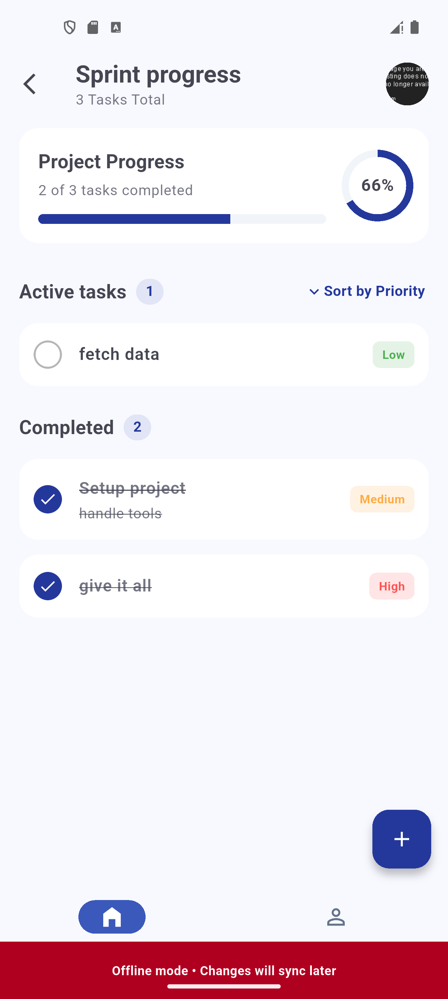
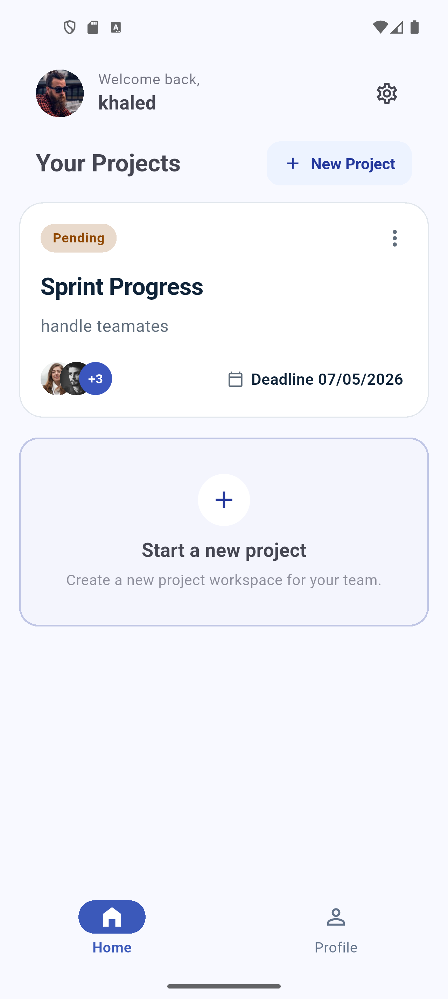
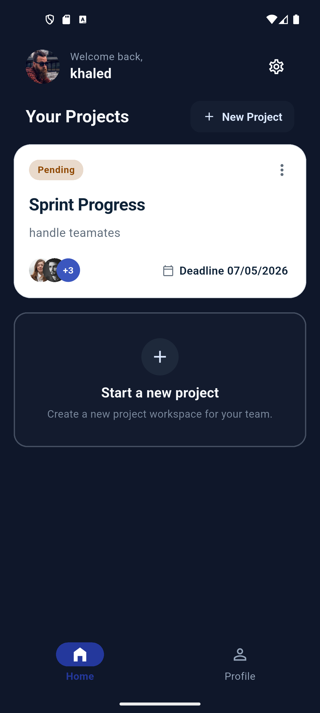
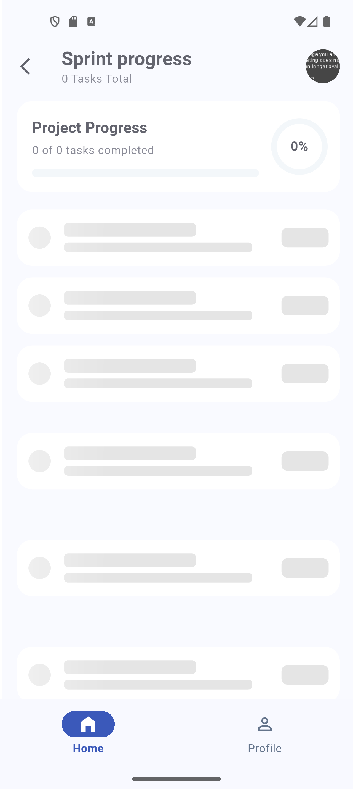
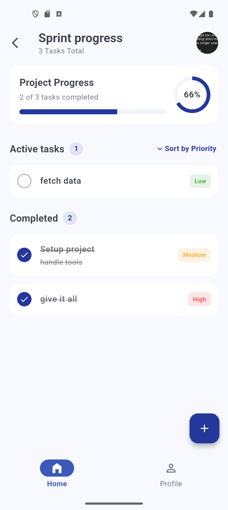
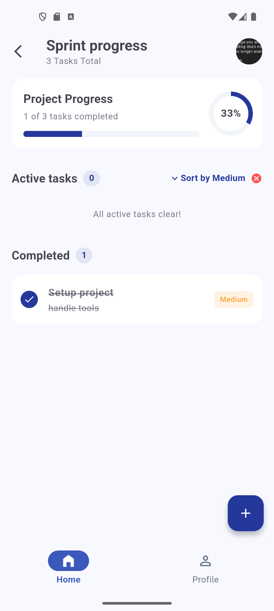
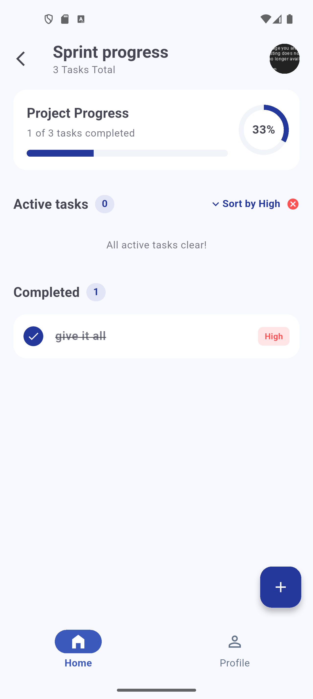
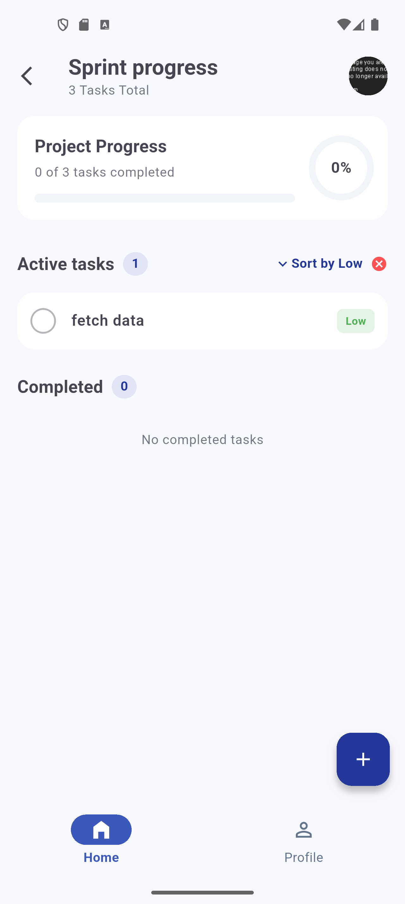
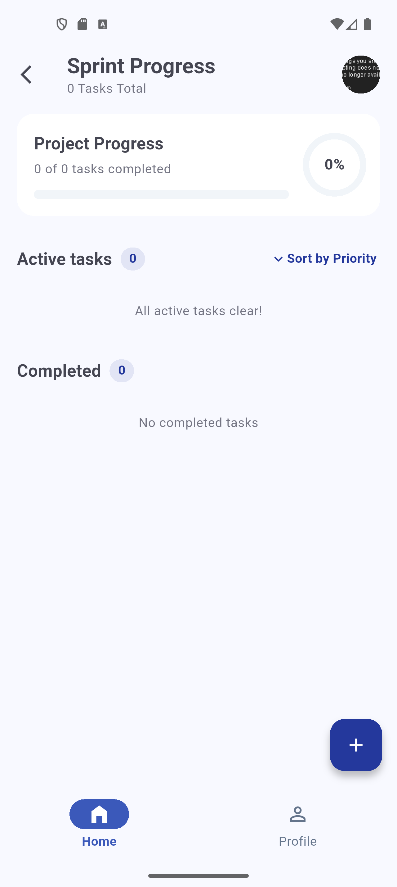

# 🛠️ Task Craft — Production-Ready Task Engine

A high-performance, enterprise-grade task management application built with **Flutter** and **Dart**. This repository serves as an architectural blueprint shifting away from basic, fragmented state tracking into a strict, **Single Source of Truth (SSOT)** data pipeline optimized for sub-millisecond fluid UI adaptations and flawless rendering stability.

---

## 🏗️ Architecture Philosophy & System Overview

Task Craft strictly implements **Clean Architecture** decoupled into isolated layers (**Domain, Data, and Presentation**), driving robust modularity and seamless unit testing.


- **Domain Layer:** Core business rules, entities, and repository interfaces (Pure Dart, zero framework dependencies).
- **Data Layer:** Repository implementations, local data sources (Hive), and remote data sources (Supabase via `ApiClient`).
- **Presentation Layer:** State management (BLoC), responsive UI layouts, and atomic reusable widgets.

---

## ⚡ Advanced Core Features & Engineering Breakthroughs

### 1. Robust Offline-First Pipeline (SSOT Sync Engine)

- **The Strategy:** Implements an optimistic-update UI flow. Writes or modifications instantly update the local cache (**Hive**) so the UI responds in sub-milliseconds.
- **The Resiliency:** If the remote network is unavailable (`NetworkException`), the repository gracefully captures the state and passes the transaction payload to a background **`SyncManager`**. When connection returns, the queue flushes sequentially to Supabase without dropping headers or missing authorization tokens.



### 2. Error Handling & Unified Code Generation

- **The Strategy:** Errors are caught inside the generic `ApiClient` and converted into explicit application domain exceptions (e.g., `NetworkException`, `ServerException`). A centralized `DioErrorHandler` maps backend errors into precise localization strings.
- **Automation Engine:** Leveraging **`Freezed`** for type-safe data schemas/immutable states and **`Injectable`** with **`GetIt`** for automated dependency injection. This eliminates manual boilerplates and guarantees safe runtime service initialization.

### 3. Separation of Concerns: UI vs. Logic (BLoC Engine)

- **The Strategy:** View layers contain **zero business logic**. Widgets simply dispatch descriptive events to independent **BLoC (Business Logic Components)** and layout UI changes based on incoming unidirectional state streams. This makes the UI completely declarative and testable.

### 4. Type-Safe State Layout Mapping (`state.when`)

- **The Strategy:** The presentation layer utilizes `Freezed` union types to manage views. By enforcing strict **`state.when` layout evaluation**, the compiler guarantees that every lifecycle phase—`Initial`, `Loading`, `Success`, and `Failure`—is explicitly handled. This structure entirely eliminates blank screens or unhandled edge cases.

### 5. Atomic Reusable Widgets & Component Modularity

- **The Strategy:** UI items are split into atomic elements (e.g., `AppDropdownMenu<T>`, `TaskItemCard`). Layout components use generics `<T>` to delegate actions, isolate widget click boundaries, prevent hit-test absorption issues, and remain completely decouple-ready for external reuse.

### 6. Dynamic Scaling & Adaptive Light / Dark Theming

- **Responsive Layout Engine:** Utilizes **`flutter_screenutil`** to scale fonts, padding, margins, and geometric elements dynamically across different viewports.
- **Theming Strategy:** Out of the box support for custom Light and Dark theme modes matching global material configurations. Typography configurations swap instantly with zero layout displacement or recalculation overhead.

| ☀️ Light Theme Layout                           | 🌙 Dark Theme Layout                          |
| ----------------------------------------------- | --------------------------------------------- |
|  |  |

---

## 📸 Production UI States & Fluid Loading Skeletons

To prevent ugly layout shifts (Visual Jumps) when database queries resolve, the hardware-accelerated shimmer placeholder geometry matches the final production card structures:

| ⏳ 1. Layout-Matched Shimmer Phase                        | 🟢 2. Runtime Enum-Driven Pipeline                  |
| --------------------------------------------------------- | --------------------------------------------------- | --------------------------------------------------- | --- | --------------------------------------------------- |
|  |  |  |
|        |                                                     |  |     |  |
|        |                                                     |    |

---

## 📦 Core Framework Dependencies

The project utilizes an industry-standard package matrix to cleanly enforce separation of concerns:

| Dependency                  | Scope / Domain Role                                                                     |
| --------------------------- | --------------------------------------------------------------------------------------- |
| **`flutter_bloc`**          | Facilitates highly organized, unidirectional, and predictable state streams.            |
| **`freezed`**               | Code-generation tool delivering immutable structures and strict type-safe state unions. |
| **`injectable` / `get_it`** | Handles background dependency resolution, clean injection scopes, and mocks.            |
| **`hive` / `hive_flutter`** | Fast, lightweight, local NoSQL storage system acting as our caching layer.              |
| **`go_router`**             | Type-safe declarative navigation schemas and deep-linking pipelines.                    |
| **`flutter_screenutil`**    | Provides precise UI scalability and unified geometry across varying screen sizes.       |
| **`shimmer`**               | Delivers hardware-accelerated, premium placeholder skeleton transitions.                |

---

## 🚀 Local Installation & Execution Guide

Follow these steps to configure, build, and deploy the application locally:

### 1. Environment Verification

Ensure your local Flutter installation passes all performance and target configurations:

```bash
flutter doctor
```
